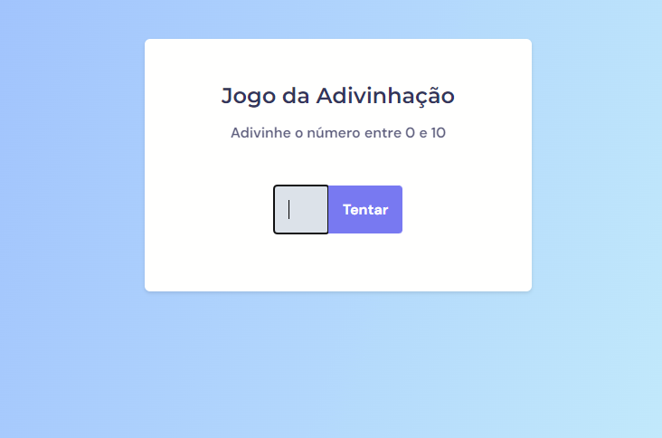

<h1> Pequeno projeto de estudo em HTML, CSS e JAVASCRIPT. </h1> 
  
<h2> JOGO DA ADIVINHAÇÃO: ADIVINHE O NÚMERO DE 0 A 10. </h2>
 
<figure>

<figcaption> tela principal do jogo </figcaption>
</figure>

 Projeto desenvolvido no curso Explorer da <a href="app.rocketseat.com.br">RocketSeat</a> 
